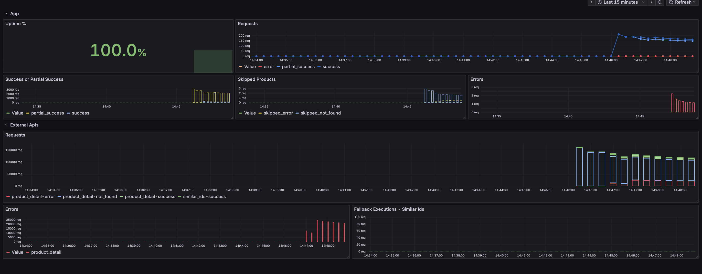
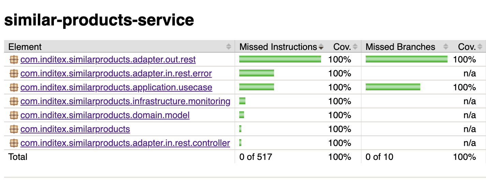

# Similar Products Service

### Overview
The **Similar Products Service** retrieves product details and their related similar products from an external API.  
It applies resilience patterns (retry, circuit breaker, fallback) and records metrics for monitoring via Grafana.  
Caching (in-memory or Redis) is used to improve performance and reduce external API calls.

### How to run Local
The application provides a **local profile** that uses in-memory cache and mocks for the external API.

- **From console**: ```mvn spring-boot:run -Dspring-boot.run.profiles=local```.
- **From IntelliJ (or any IDE)** set profile **local**

### How to run in "Prod" Mode
1) Build the application JAR: ```mvn clean install```
2) Start the stack (application + Redis + Grafana) with: ```docker-compose up --build```

### Monitoring with Grafana
Grafana is exposed on port 3080 (to avoid conflicts if you already have Grafana running).
- Dashboard URL: http://localhost:3080/d/similar-products-metrics/


### API Documentation
Swagger UI available at: http://localhost:5000/swagger-ui/index.html

### Postman Collection
A Postman collection is included to simplify local testing:
[SimilarProducts Collection.postman_collection.json](postman/SimilarProducts%20Collection.postman_collection.json)

### Test Coverage
Current coverage results:Coverage


### Key Features
- Resilience: Retry + CircuitBreaker + Fallback (via Resilience4j).
- Error Handling:
  - 404 → mapped to NotFoundException. 
  - 5xx or unexpected errors → mapped to ExternalServiceException.
- Caching:
  - Local profile → in-memory. 
  - Production profile → Redis. 
- Monitoring: Metrics recorded for success, not-found, error, and fallback cases.
